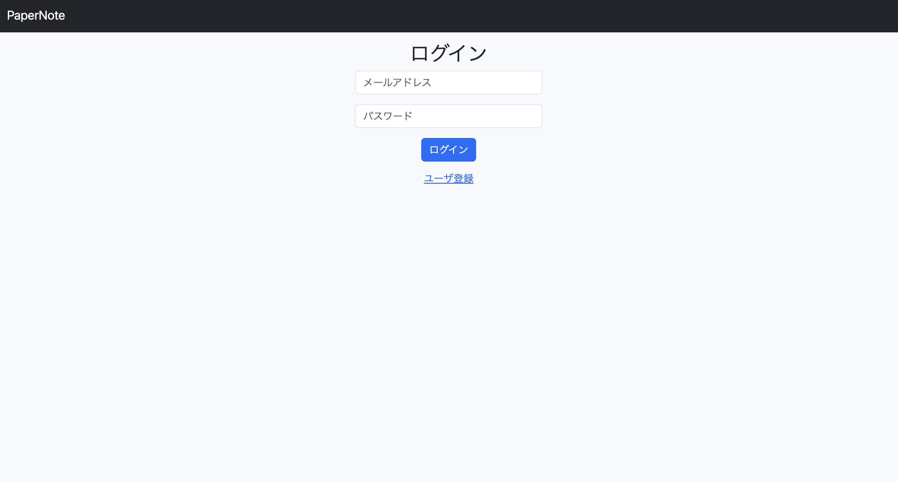
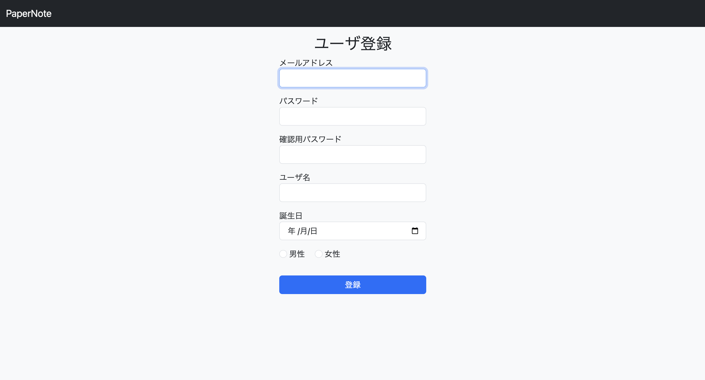
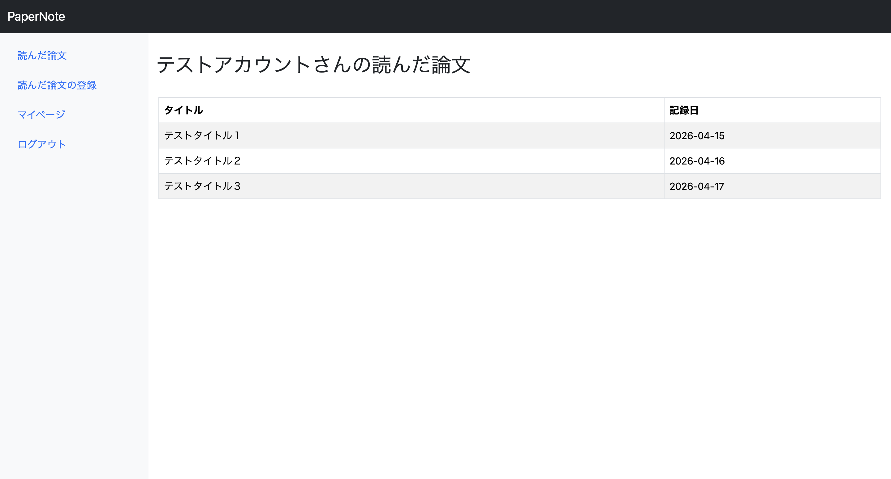
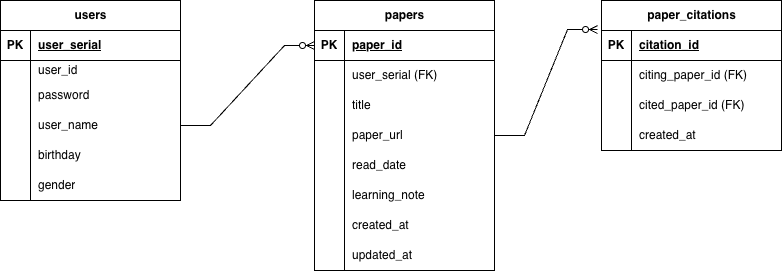

# Paper Note

読んだ論文を記録し、タイトル・読了日・URL・得た知見を管理できるwebアプリです。
先行研究・後続研究の関係を登録することができ、各論文のつながりや各研究分野における位置関係を整理することができます。

## 作成目的
研究活動の中で、論文を読むことが多くなったため、読んだ論文をわかりやすく整理できるように作成しました。

## 使用技術
* Java
* Spring Boot
* Thymeleaf
* Bootstrap
* PostgreSQL
* Spring Security
* MyBatis
* Railway
* Git / GitHub

## 実装機能
* ユーザ登録、ログイン
* 論文の登録
* 記録論文の一覧表示
* 記録論文の編集・削除
* 先行、後続研究の登録・表示
* マイページ表示・編集

## 工夫した点
このwebアプリケーションでは、認証と認可の機能を安全に実装するため Spring Security を使用しました。
データベース上では各ユーザのパスワードは暗号化を行い保存しています。Spring Security の BCryptPasswordEncoder では標準でソルトが実装されているため、ハッシュ化したパスワードを保存しています。
また、各論文同士の先行、後続研究の関係を効率よく、安全に保存するためデータベースの設計を工夫しました。
具体的には、論文の情報を格納するテーブルとは別に引用情報を格納するテーブルを作成し、各論文の関係を簡潔に示せるようにしました。
UIの面では、先行論文、後続論文を登録する際に選択中の論文をわかりやすく表示するため、Choises.jsというライブラリを使用しています。
さらに、あらゆる端末で閲覧できるように、レスポンシブ対応を行い小さい画面でもレイアウトが崩れないようにしました。

## 作成アプリケーションのイメージ
### ログイン画面

### ユーザ登録画面

### 登録論文一覧画面

## 公開URL
[作成アプリケーションはこちらから閲覧できます](https://papernote-production.up.railway.app/login "PaperNote")

## テストアカウント
以下のアカウントを使用してwebアプリを閲覧することができます。 
メールアドレス：test@example.com  
パスワード：test1234

## ER図
  
ER図の作成にはDraw.ioを使用しました。

## 今後の改善点
現在の論文一覧表示画面では検索機能がないため、登録論文が多くなったときに参照したい論文を発見するまでに時間がかかってしまいます。
そのため、論文の検索機能・並び替え機能の実装を考えています。
また、現在のアプリケーションでは体感的に動作が遅く感じることがあります。
そのため、サーバサイドとフロントエンドを分割しRestAPI化することで、通信量の削減や画面更新の効率化を図ることでユーザの体感速度を改善したいと考えています。

